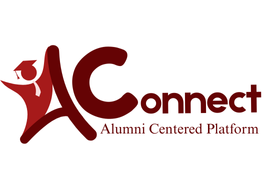

# SDCA Connect 

**Official Website**: [sdcaconnect.online](https://sdcaconnect.online)

Welcome to **SDCA Connect**! This is the official alumni connection portal designed to bridge the gap between alumni, students, and the faculty of the institution. SDCA Connect serves as a central hub where graduates can stay connected, find opportunities, and participate in institutional events.

## 🌟 Features

### 1. 👥 Alumni Network
Stay in touch with your batchmates and other alumni. The platform allows you to search for alumni, connect with them, and expand your professional network. 

### 2. 💼 Job Opportunities
A dedicated job portal where alumni and administrators can post and find career opportunities. Whether you are looking for your first job, a career shift, or looking to hire fellow alumni, this feature makes it easy to share and apply.

### 3. 💬 Community Forum
Engage in rich discussions with fellow alumni. The forum section allows users to share knowledge, ask questions, and build a supportive community around various topics of interest.

### 4. 📅 Events Management
Keep track of both upcoming and past events. Whether it's a homecoming, a seminar, or a networking night, the events portal ensures you never miss a gathering.

### 5. 🏛️ Officers Directory
Meet the alumni leaders. The officers section highlights the current leaders of the alumni association, making it easy to reach out to them.

### 6. ✉️ Direct Messaging
The built-in messenger allows for seamless, private communication between users to foster closer relationships and professional collaboration.

## 🛠️ Technology Stack
This application is built using:
* **Framework**: [CodeIgniter 3](https://codeigniter.com/)
* **Frontend**: HTML5, CSS3, JavaScript, [Bootstrap 4](https://getbootstrap.com/), Tailwind CSS
* **Database**: MySQL

## 🔒 Access Levels
The system supports multi-level user access:
1. **Administrators**: Full access to manage users, approve accounts, manage job postings, events, and monitor the platform.
2. **Alumni (Users)**: Access to networking features, forums, job postings, and events.

---

*SDCA Connect is dedicated to fostering a lifelong relationship between the institution and its graduates.*